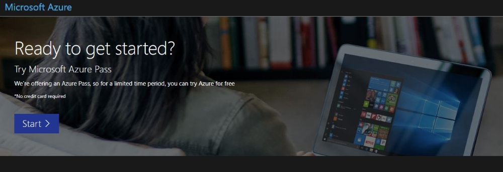
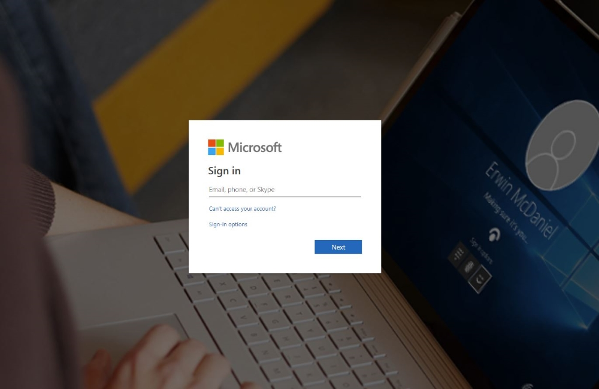
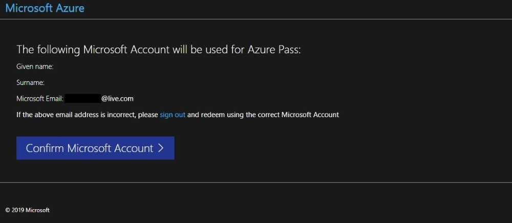
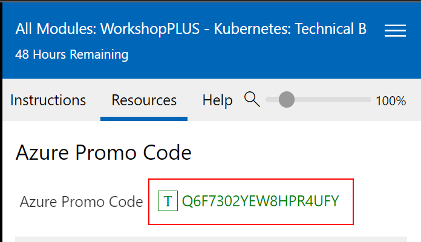
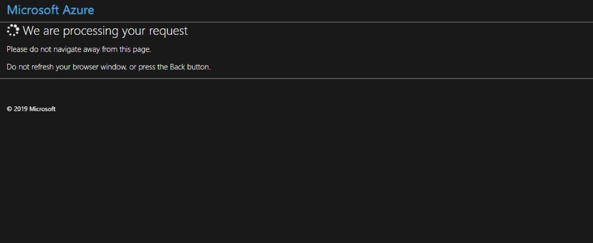
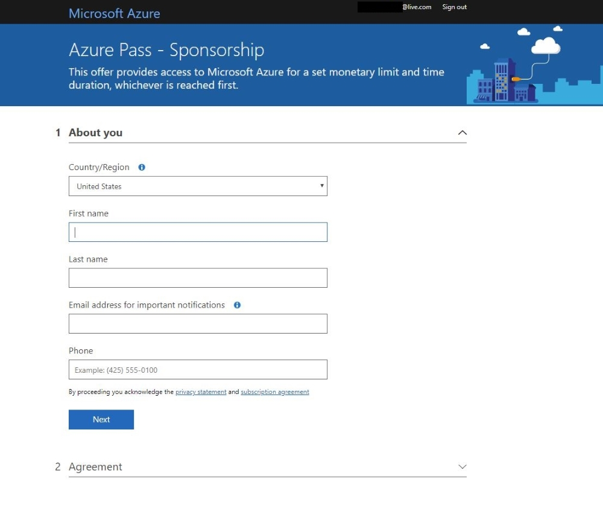
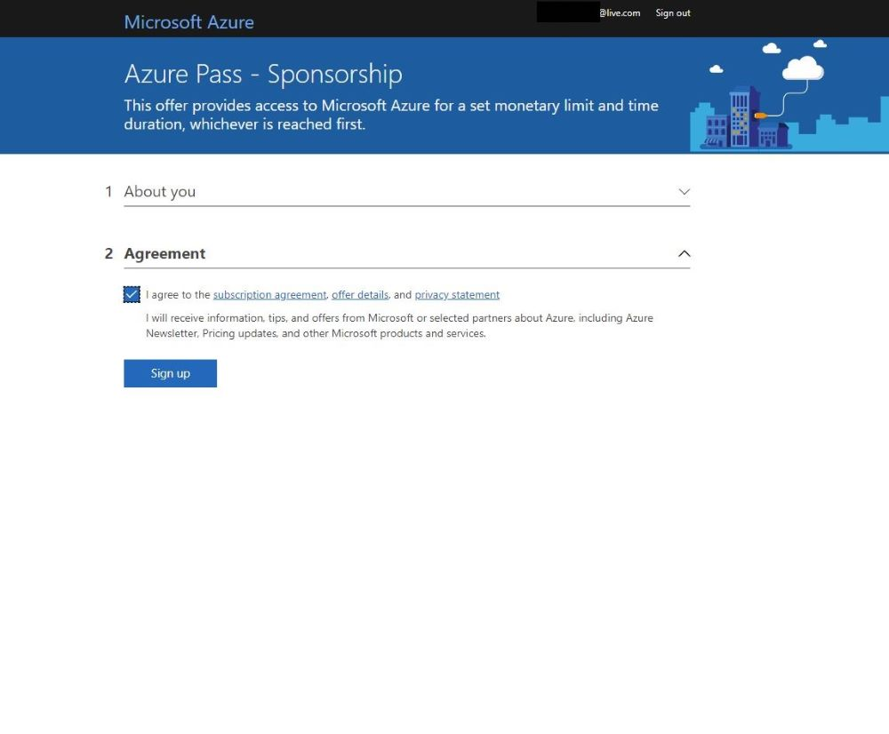
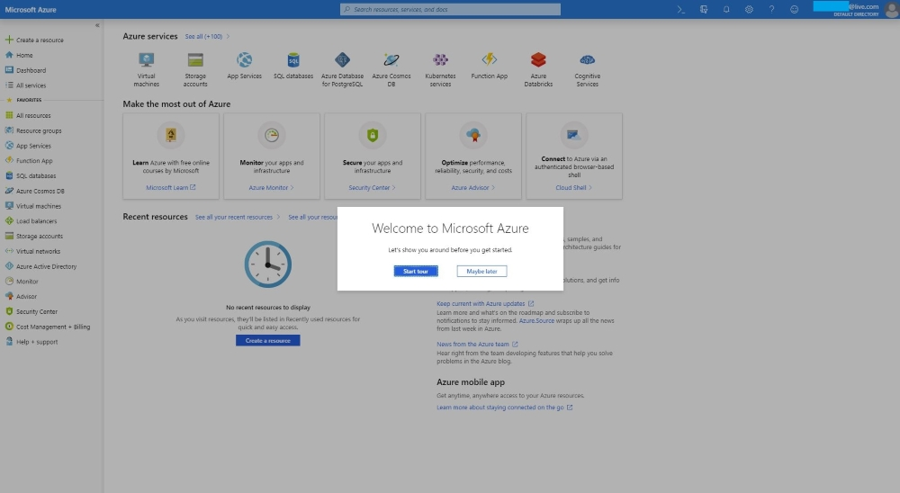
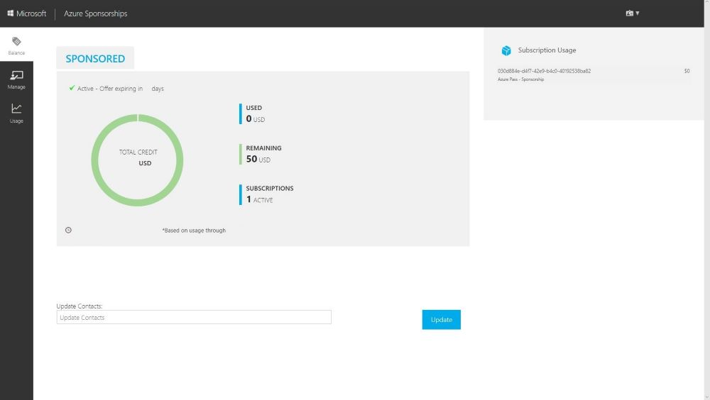

# Create a Microsoft Azure Pass Subscription

### Creating an Azure Pass subscription is a two step process.

1. Redeem your Azure Pass Promo Code
2. Activate your subscription

### Step 1: Redeeming a Microsoft Azure Pass Promo Code:

In the lab VM, open a browser and navigate to: www.microsoftazurepass.com

> It is recommended you close all browsers and open a new In-Private Browser session. Other log-ins can persist and cause errors during the activation step.

Click the start button to get started.

Enter your account login information and select “Sign In”.

Click “Confirm” if the correct email address is listed.

Select the **Resources** tab on the Instructions Panel

Place the cursor in the **Enter Promo Code** text box.  Click the **T** button by the *Azure Promo Code*. 

After you enter your promo code click “Claim Promo Code”. 

It may take up to 5 minutes to process the redemption.

### Step 2: Activate your subscription:

When the redemption process is completed, it will redirect to the sign up page.

Enter your account information and click “Next”.

Click the agreement check box and click the Sign up button.

It may take a few minutes to process the request.

Your Azure subscription is ready!

You can check the balance of your Azure Pass Credits on https://www.microsoftazuresponsorships.com/balance

[List of Modules](#modules-list)