# Lab Module 1: Core Kubernetes Concepts 


> Estimated Duration: 60 minutes  

## Module 1 Table of Contents

[Exercise: Create a Basic Azure Kubernetes Service (AKS) Cluster](#exercise-create-a-basic-azure-kubernetes-service-aks-cluster) 

[Exercise: Creating a Pod Declaratively](#exercise-creating-a-pod-declaratively)  

[Exercise: Adding/Updating/Deleting Labels on a Pod](#exercise-addingupdatingdeleting-labels-on-a-pod) 

[Exercise: Working with Deployments](#exercise-working-with-deployments)  

[Exercise: Working with Services](#exercise-working-with-services)  

[Exercise: Cleanup](#exercise-cleanup)


# Exercise: Create a Basic Azure Kubernetes Service (AKS) Cluster  

In this exercise you will create a simple AKS cluster.  In the next module, you'll create a more complete one.  


### Task 1 - Login into your subscription and create a resource group

1. Open a Windows Terminal window (defaults to PowerShell).  

  

> Windows Terminal allows you to open tabbed command terminals.

2. Login to Azure.

```PowerShell
az login
```

3. Set the current subscription.

```PowerShell
az account set --subscription "Azure Pass - Sponsorship"
```

4. Select the region closest to your location.  Use '**eastus**' for United States workshops, '**westeurope**' for European workshops.  Ask your instructor for other options in your region:  @lab.DropDownList(region)[eastus,westus,canadacentral,westeurope,centralindia,australiaeast]

5. Define variables. 

```PowerShell
$INSTANCE_ID="@lab.LabInstance.Id"
$AKS_RESOURCE_GROUP="azure-$($INSTANCE_ID)-rg"
$LOCATION="@lab.Variable(region)"
$AKS_IDENTITY="identity-$($INSTANCE_ID)"
```

6. Get list of available VM sizes with 2 cores in your region.

```PowerShell
az vm list-sizes --location $LOCATION `
                 --query "[?numberOfCores == ``2``].{Name:name}" -o table
```

7. Set the VM SKU to one of the available values or use the default below.

```PowerShell
$VM_SKU="Standard_D2as_v5"
```

8. Create Resource Group.

```PowerShell
az group create --location $LOCATION `
                --resource-group $AKS_RESOURCE_GROUP 
```


### Task 2 - Create a basic cluster using Azure CLI

1. Define variables for AKS cluster.

```PowerShell
$AKS_NAME="aks-$($INSTANCE_ID)"
Write-Host "AKS Cluster Name: $AKS_NAME"
```

2. Create a simple AKS cluster.

```PowerShell
az aks create --node-count 2 `
              --generate-ssh-keys `
              --node-vm-size $VM_SKU `
              --name $AKS_NAME  `              
              --resource-group $AKS_RESOURCE_GROUP 
```

> The creation process will take able 5-10 minutes.

3. Once complete, connect the cluster to your local client machine.

```PowerShell
az aks get-credentials --name $AKS_NAME `
                       --resource-group $AKS_RESOURCE_GROUP 
```

4. Confirm the connection to the cluster.

```PowerShell
kubectl get nodes 
```

This should return a list of nodes similar to the one below:

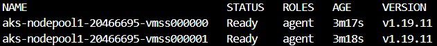  

[Module 1 Table of Contents](#module-1-table-of-contents)

[List of Modules](#modules-list)


# Exercise: Creating a Pod Declaratively  

This Exercise demonstrates the use of a YAML file to create a pod declaratively.  


### Task 1 - Create a Pod declaratively

1. Change into the **Module1** folder

```PowerShell
cd C:\k8s\labs\Module1
```

2. Use the YAML file provided to create a Pod.  You may want to open the **simple-pod.yaml** file and review its contents.

The pod definition contains the **Nginx** container that listens to port 80.  

```PowerShell
kubectl apply -f simple-pod.yaml
```

3. Now, make sure pod is up and running.

```PowerShell
kubectl get pods
```

You should see a pod named **nginx-pod**

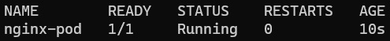  

4. Add a second pod, then check the list again.

```PowerShell
kubectl apply -f simple-pod2.yaml
kubectl get pods
```


### Task 2 - Filter pods based on a label

1. Show all the labels in the pods

```PowerShell
kubectl get pods --show-labels
```

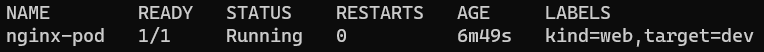  

2. Let's say you want to list pods that have a label named  **kind=web** associated with them. You can use **-l** switch to apply filter based on labels.  

```PowerShell
kubectl get pod -l kind=web
```

3. To prove that this works as expected, run the command again but change the value of label **kind** to **db**. Notice, this time *kubectl* doesn't return any pods because there are no pods that match the label **kind** and a value of **db**.  

```PowerShell
kubectl get pod -l kind=db
```


### Task 3 - View complete definition of the Pod 

1. Query Kubernetes to return the complete definition of a Pod from its internal database by exporting the output (**-o**) to **YAML**.  Then pipe the result to a file.

```PowerShell
kubectl get pods nginx-pod -o yaml > mypod.yaml
```

> To view the JSON version, use the **-o json** flag instead.

2.  View the contents of the generated file in VS Code (or an editor of your choice).

```PowerShell
code mypod.yaml
```
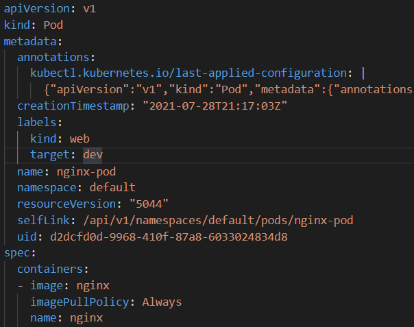  

**NOTE:** Observe all the properties that Kubernetes populated with default values when it saved the Pod definition to its database.


[Module 1 Table of Contents](#module-1-table-of-contents)

[List of Modules](#modules-list)


# Exercise: Adding/Updating/Deleting Labels on a Pod  

In this Exercise, you will create a pod that has labels associated with it. Labels make it easy to filter the pods later.  Labels play a vital role in the Kubernetes ecosystem, so it's important to understand their proper usage.  


### Task 1 - Assign a new label to a running Pod 

1. Assign a new label (key=value) pair to a running pod. This comes in handy when you are troubleshooting an issue and would like to distinguish between different pod(s).  Assign a new label **health=fair** to the pod **nginx-pod**, which is already running.  

```PowerShell
kubectl label pod nginx-pod health=fair
```

2. Run the command below to show the pod labels.  Notice that now an additional label is shown with the pod.  

```PowerShell
kubectl get pods nginx-pod --show-labels
```


### Task 2 - Update an existing label that is assigned to a running pod  

1. Update the value of an existing label that is assigned to a running pod. Change the value of the label **kind=web** to **kind=db** of the **nginx-pod** pod. 

```PowerShell
kubectl label pod nginx-pod kind=db --overwrite
```

**--overwrite** is needed because the pod is running and won't accept changes otherwise. 

2. Show the pod labels again.  Notice that *kind* has changed from **web** to **db**.  

```PowerShell
kubectl get pods --show-labels
```


### Task 3 - Delete a label that is assigned to a running Pod

1. Delete the label **health** from the  **nginx-pod** pod.

```PowerShell
kubectl label pod nginx-pod health-
```

**NOTE:** Notice the minus (**-**) sign at the end of the command. You can also remove a label from all running pods by using the **--all** flag.  

```PowerShell
kubectl label pod health- --all
```

2. Run the command below to show the pod labels again. Notice that *health* is not part of the list of labels.

```PowerShell
kubectl get pods --show-labels
```


### Task 4 - Delete Pods based on their labels

1. Delete all the Pods that match a specific label. 

```PowerShell
kubectl delete pod -l target=dev 
```


[Module 1 Table of Contents](#module-1-table-of-contents)

[List of Modules](#modules-list)


# Exercise: Working with Deployments

In this Exercise, you will create a Deployment and rollout an application update.  Deployments provide a consistent mechanism to upgrade an application to a new version, while keeping the downtime to a minimum.  Note that internally, Deployments use *ReplicaSets* for managing Pods.  However, you never work directly with *ReplicaSets* since Deployments abstract out that interaction.  


### Task 1 - Create a new Deployment 

The **ng-dep.yaml** file contains a Deployment manifest.  The Pod in the *template* contains an *nginx* container with a tag **1.0**.  The **1.0** represents the version of this container and hence of the application running inside it.   

1. Create a Deployment and a Service to access the Pods of the deployment.  

```PowerShell
kubectl apply -f ng-dep.yaml
kubectl apply -f ng-svc.yaml
```

**NOTE:** The *--record* flag saves the command you applied in the deployment's ReplicaSet history.  This helps in deciding which previous Revision to roll back to if needed.


2. Run the following command to see the Pods, ReplicaSets, Deployments and Services that were created. 

```PowerShell
kubectl get all --show-labels  
```
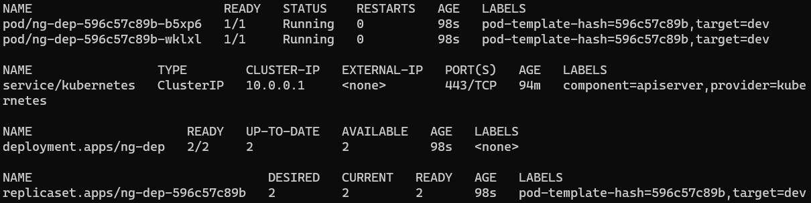   


### Task 2 - Access version 1.0 of application

1. Wait about 3-4 minutes to allow Azure to create a Public IP address for the service.  Check to see if an address has been assigned by getting the list of services.

```PowerShell
kubectl get svc
```

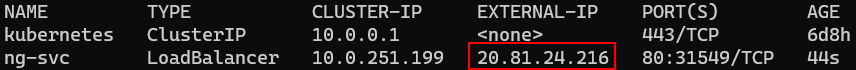  


2. When you see an **EXTERNAL-IP** assigned, open a browser with that address.  Example: **http://20.81.24.216**    

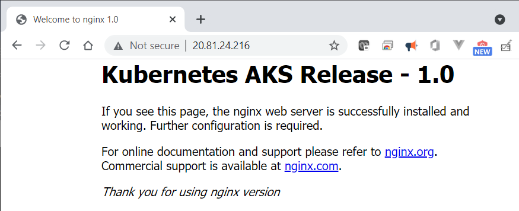  


### Task 3 - Update the Deployment to version 2.0

You are now going to update the Deployment to use version **2.0** of the container instead of **1.0**.  This can be done in one of two ways. One approach is to use *imperative* syntax, which is faster and is often used during the development/testing stage of an application.  The alternate method is to update the YAML file and then to reapply it to teh cluster.

1. To start rolling out the new update, change the container image tag from **1.0** to **2.0** by running this command:  
   
```PowerShell
kubectl set image deployment ng-dep nginx=k8slab/nginx:2.0
```

2. In the command above, **ng-dep** is the name of Deployment and **nginx** is the name of the container within the Pod template.  The change will force the Deployment to create a new ReplicaSet with an image tagged **2.0**.

3. List all the pods and notice that old pods are terminating and that new Pods have been created.    

```PowerShell
kubectl get pods
```

4. Run the follwing command to review the Deployment definition with the updated value of container image:  

```PowerShell
kubectl describe deployment ng-dep
```

  

> Notice the Image section (under Containers) shows the value of container image as **2.0**.

5. Run the command to view the Pods, ReplicaSets and Deployments again.

```PowerShell
kubectl get all
```

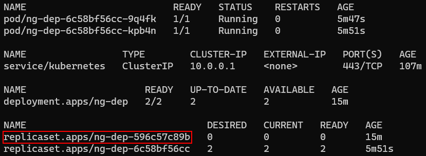  

> Notice that the old replica set still exists, even though it has 0 Desired Pods. 

6. Run the *describe* command on that old ReplicaSet.

```PowerShell
kubectl describe rs <old replicaset name>
```

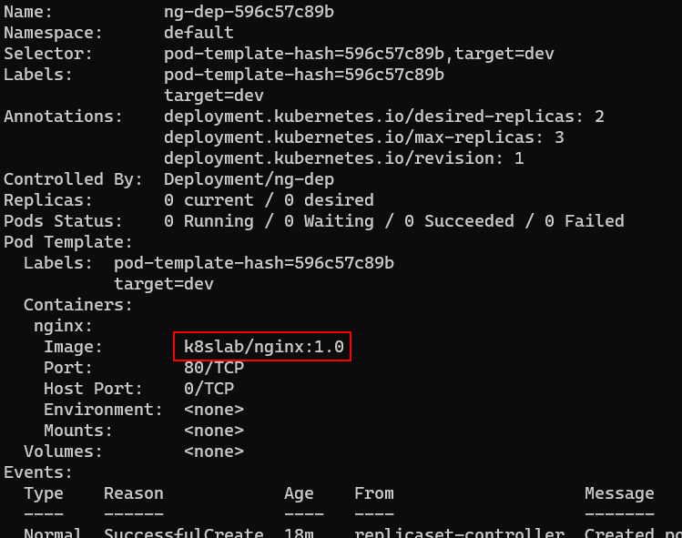  

> Notice that the old definition still has the previous version number.  This is maintained so you can roll back the change to that version if you which.

7. Access the 2.0 version of application by refreshing the browser at the same address as above.  

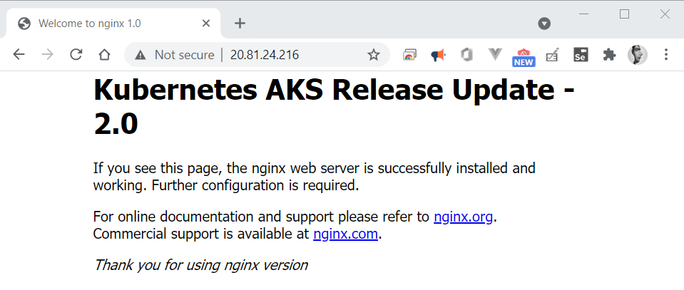  


### Task 4 - Rollback the Deployment

The purpose of maintaining the previous **ReplicaSet** is to be able to rollback changes to any previous version.

1. Review the deployment history.

```PowerShell
kubectl rollout history deploy/ng-dep
```

2. Rollback the Deployment to the previous version.

```PowerShell
kubectl rollout undo deploy/ng-dep
```

3. Wait a few seconds and refresh the browser again.

  

> Notice the site is back to the previous version.


### Task 5 - Delete the Deployment and Service

1. Delete the Deployment and Service.

```PowerShell
kubectl delete deployment ng-dep
kubectl delete service ng-svc
```

**NOTE:** It may take a few minutes to delete the service because has to delete the Public IP resource in Azure.


[Module 1 Table of Contents](#module-1-table-of-contents)

[List of Modules](#modules-list)


# Exercise: Working with Services  

In this Exercise you will create a simple Service.  Services help you expose Pods externally using label selectors.  


### Task 1 - Create a new Service

1. Create a deployment.

```PowerShell
kubectl apply -f sample-dep.yaml
```

2. The **sample-svc.yaml** file contains a Service manifest.  Services use label selectors to determine which Pods it needs to track and forward the traffic to.  

1. Review running Pods and their labels.  

```PowerShell
kubectl get pods --show-labels
```

> Notice the label **sample=color** that is associated with the Pods.  

2. Open the **sample-svc.yaml** file and examine the **selector** attribute.  Notice the **sample: color** selector.  This Service will track all Pods that have a label **sample=color** and load balance traffic between them.  

3. Create the Service.

```PowerShell
kubectl apply -f sample-svc.yaml
```

4. Check the of newly created service.

```PowerShell
kubectl get svc -o wide
```

The command above will display the details of all available services along with their label selectors.  You should see the **sample-svc** Service with **PORTS 80:30101/TCP** and **SELECTOR sample=color**.  


### Task 2 - Access the sample-svc Service

1. Open a browser and navigate to the IP address shown in the output of the previous command.  

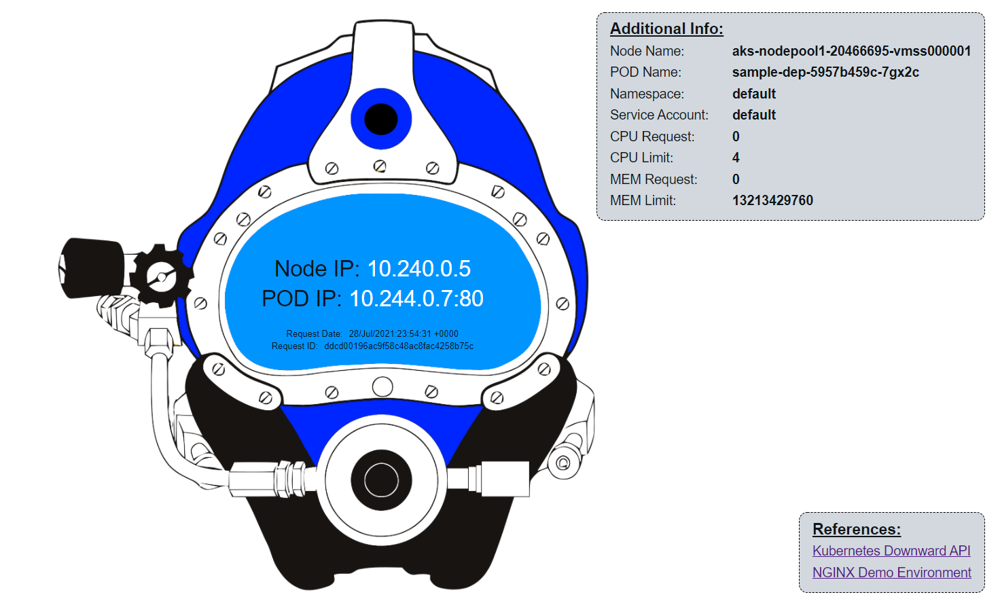

2. The website displays the Node IP/Pod IP address of the pod currently receiving the traffic through the service's load balancer.  The page refreshes every 3 seconds and each request may be directed to a different pod, with a different IP address.   This is the service's internal load balancer at work.


### Task 3 - Delete the Deployment and Service

Deleting any Pod will simply tell Kubernetes that the Deployment is not in its *desired* state and it will create a replacement.  You can only delete Pods by deleting the Deployment.  

1. Delete the Deployment.

```PowerShell
kubectl delete deployment sample-dep
```

2. The Service is independent of the Pods it services, so it's not affected when the Deployment is deleted.  Anyone trying to access the service's address will simply get a 404 error.  If the Deployment is ever re-created, the Service will automatically start sending traffic to the new Pods.
   
3.  Delete the Service.

```PowerShell
kubectl delete service sample-svc
```


[Module 1 Table of Contents](#module-1-table-of-contents)

[List of Modules](#modules-list)


# Exercise: Cleanup


### Task 1 - Delete the cluster

When you're done working with the cluster, you can delete it if you wish.  This will ensure you don't incur any costs on your sponsorship subscription when you're not working on the labs.  

1. Deleting the cluster is as easy as creating it.

```PowerShell
az aks delete --name $AKS_NAME  --resource-group $AKS_RESOURCE_GROUP
```


[List of Modules](#modules-list)

