# Lab Module 2: Azure Kubernetes Service
   

> Estimated Duration: 60 minutes  

## Module 2 Table of Contents

[Exercise: Create AKS Cluster Using Azure CLI](#exercise-create-aks-cluster-using-azure-cli)  

[Exercise: Create AKS Cluster Using Terraform](#exercise-create-aks-cluster-using-terraform) 

[Exercise: Deploying Workloads to Nodes](#exercise-deploying-workloads-to-nodes)  

[Exercise: Scaling Nodes to Meet Demand](#exercise-scaling-nodes-to-meet-demand)  

[Exercise: Examine Container Insights](#exercise-examine-container-insights)  

[Exercise: Cleanup Resources](#exercise-cleanup-resources)  


# Exercise: Create AKS Cluster Using Azure CLI

In this exercise you will create an AKS cluster using the Azure Command-line Interface (CLI).  

You should complete this exercise **OR** the [Exercise: Create AKS Cluster Using Terraform](#exercise-create-aks-cluster-using-terraform), **NOT BOTH!**  


### Task 1 - Create variables resource group

1. Open a Windows Terminal window (defalts to PowerShell).  

  

> Windows Terminal allows you to open tabbed command terminals.

2. Login to Azure.

```PowerShell
az login
```

3. Set the current subscription.

```PowerShell
az account set --subscription "Azure Pass - Sponsorship"
```

4. Select the region closest to your location.  Use '**eastus**' for United States workshops, '**westeurope**' for European workshops.  Ask your instructor for other options in your region:  @lab.DropDownList(region)[eastus,westus,canadacentral,westeurope,centralindia,australiaeast]

5. Define variables. 

```PowerShell
$INSTANCE_ID="@lab.LabInstance.Id"
$AKS_RESOURCE_GROUP="azure-$($INSTANCE_ID)-rg"
$LOCATION="@lab.Variable(region)"
$AKS_IDENTITY="identity-$($INSTANCE_ID)"
```

6. Get list of available VM sizes with 2 cores in your region.

```PowerShell
az vm list-sizes --location $LOCATION --query "[?numberOfCores == ``2``].{Name:name}" -o table
```

7. Set the VM SKU to one of the available values 

```PowerShell
$VM_SKU="Standard_D2as_v5"
```

8. Create Resource Group.

```PowerShell
az group create --location $LOCATION  --resource-group $AKS_RESOURCE_GROUP 
```

9. Create User Managed Identity

```PowerShell
$AKS_IDENTITY_ID=$(az identity create --name $AKS_IDENTITY --resource-group $AKS_RESOURCE_GROUP --query id -o tsv)
```


### Task 2 - Create a Virtual Network and a Subnet

1. Define variables for network resources.

```PowerShell
$AKS_VNET="aks-$($INSTANCE_ID)-vnet"
$AKS_VNET_SUBNET="aks-$($INSTANCE_ID)-subnet"
$AKS_VNET_ADDRESS_PREFIX="10.0.0.0/8"
$AKS_VNET_SUBNET_PREFIX="10.240.0.0/16"
```

2. Create an Azure Virtual Network and a Subnet. 
   
```PowerShell
az network vnet create --resource-group $AKS_RESOURCE_GROUP `
                       --name $AKS_VNET `
                       --address-prefix $AKS_VNET_ADDRESS_PREFIX `
                       --subnet-name $AKS_VNET_SUBNET `
                       --subnet-prefix $AKS_VNET_SUBNET_PREFIX 
```

3. Get virtual network default subnet id

```PowerShell
$AKS_VNET_SUBNET_ID=$(az network vnet subnet show --resource-group $AKS_RESOURCE_GROUP --vnet-name $AKS_VNET --name $AKS_VNET_SUBNET --query id -o tsv)

Write-Host "Default Subnet ID: $AKS_VNET_SUBNET_ID"

```


### Task 3 - Create a Log Analytics Workspace (if needed)

1. Create a Log Analytics Workspace.

```PowerShell
$LOG_ANALYTICS_WORKSPACE_NAME="aks-$($INSTANCE_ID)-law"
$LOG_ANALYTICS_WORKSPACE_RESOURCE_ID=$(az monitor log-analytics workspace create --resource-group $AKS_RESOURCE_GROUP --workspace-name $LOG_ANALYTICS_WORKSPACE_NAME --query id -o tsv)
Write-Host "LAW Workspace Resource ID: $LOG_ANALYTICS_WORKSPACE_RESOURCE_ID"

```


### Task 4 - Create an AKS Cluster with a System Node Pool

1. Use all the prior settings and resources to create the AKS cluster.  This step will take 5-10 minutes to complete.

**NOTE:** See Microsoft reference: https://docs.microsoft.com/en-us/cli/azure/aks?view=azure-cli-latest#az_aks_create

```PowerShell
$AKS_NAME="aks-$($INSTANCE_ID)"
Write-Host "AKS Cluster Name: $AKS_NAME"
```


```PowerShell
az aks create --resource-group $AKS_RESOURCE_GROUP `
              --generate-ssh-keys `
              --enable-managed-identity `
              --assign-identity $AKS_IDENTITY_ID `
              --node-count 1 `
              --enable-cluster-autoscaler `
              --min-count 1 `
              --max-count 3 `
              --network-plugin azure `
              --service-cidr 10.0.0.0/16 `
              --dns-service-ip 10.0.0.10 `
              --docker-bridge-address 172.17.0.1/16 `
              --vnet-subnet-id $AKS_VNET_SUBNET_ID `
              --node-vm-size $VM_SKU `
              --nodepool-name system1 `
              --enable-addons monitoring `
              --workspace-resource-id $LOG_ANALYTICS_WORKSPACE_RESOURCE_ID `
              --enable-ahub `
              --name $AKS_NAME
```

2. Once the cluster is ready (after at least 5 minutes), connect your local machine to it.

```PowerShell
az aks get-credentials --name $AKS_NAME --resource-group $AKS_RESOURCE_GROUP
```

3. List the nodes in the cluster.  There should be **1** node to start with.

```PowerShell
kubectl get nodes
```

4. Get the list of system nodes only. At this point, the list should return **1** node.

```PowerShell
kubectl get nodes -l="kubernetes.azure.com/mode=system"
```

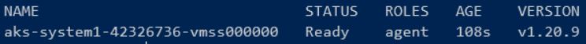  

5. List the node pools in the cluster.  There should be 1 node pool returned.

```PowerShell
az aks nodepool list --cluster-name $AKS_NAME --resource-group $AKS_RESOURCE_GROUP -o table
```

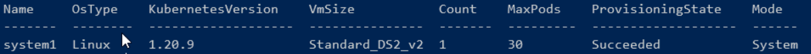


### Task 5 - Create a Linux User Node Pool

1. Create a Linux user node pool.

```PowerShell
az aks nodepool add --resource-group $AKS_RESOURCE_GROUP `
                    --cluster-name $AKS_NAME `
                    --os-type Linux `
                    --name linux1 `
                    --node-count 1 `
                    --enable-cluster-autoscaler `
                    --min-count 1 `
                    --max-count 3 `
                    --mode User `
                    --node-vm-size $VM_SKU
```

2. List the nodes in the cluster.  There should be 2 nodes now.

```PowerShell
kubectl get nodes
```

3. Get the list of system nodes only. There should still be only 1 system node.

```PowerShell
kubectl get nodes -l="kubernetes.azure.com/mode=system"
```

4. List the node pools in the cluster.  Again there should be 2 now.

```PowerShell
az aks nodepool list --cluster-name $AKS_NAME --resource-group $AKS_RESOURCE_GROUP -o table
```

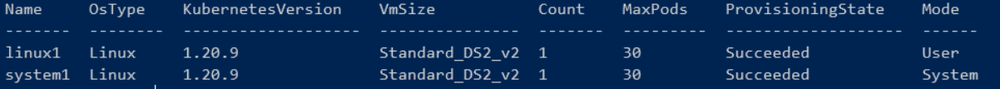


### Task 6 - Create a Windows User Node Pool

1. Create a Windows user node pool.

```PowerShell
az aks nodepool add --resource-group $AKS_RESOURCE_GROUP `
                    --cluster-name $AKS_NAME `
                    --os-type Windows `
                    --name win1 `
                    --node-count 1 `
                    --mode User `
                    --node-vm-size $VM_SKU 
```

2. List the nodes in the cluster.  There should be 3 nodes.

```PowerShell
kubectl get nodes
```

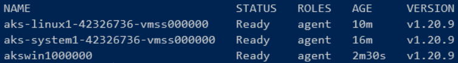

3. Get the list of system nodes only. There should still be only 1 node.

```PowerShell
kubectl get nodes -l="kubernetes.azure.com/mode=system"
```

4. Get the list of Linux nodes. There should be 2 nodes.

```PowerShell
kubectl get nodes -l="kubernetes.io/os=linux"
```

5. List the node pools in the cluster.  Again there should be 3.

```PowerShell
az aks nodepool list --cluster-name $AKS_NAME --resource-group $AKS_RESOURCE_GROUP -o table
```

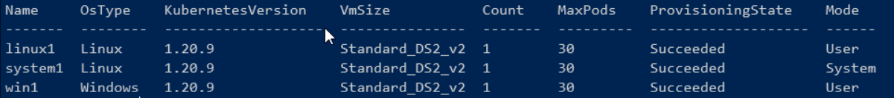 


### Task 7 - Adjust the Auto Scaler for the lab

The default settings for the AKS Auto Scaler are tuned for production environments, but take too long to scale up/down during demos and practice labs.  

1. Configure the cluster-wide auto scaling profile so all the node pool auto scalers are more responsive.  

```PowerShell
az aks update --resource-group $AKS_RESOURCE_GROUP `
              --name $AKS_NAME `
              --cluster-autoscaler-profile `
                  scale-down-delay-after-add=1m `
                  scale-down-unready-time=1m `
                  scale-down-unneeded-time=1m `
                  skip-nodes-with-system-pods=true 
```

**NOTE:** Refer to this link for a complete description of the options available: [AKS Cluster Autoscaler](https://docs.microsoft.com/en-us/azure/aks/cluster-autoscaler)


[Module 2 Table of Contents](#module-2-table-of-contents)

[List of Modules](#modules-list)


# Exercise: Create AKS Cluster Using Terraform


In this exercise you will create an AKS cluster using the Terraform utility by HashiCorp.  

You should complete this exercise **OR** the [Exercise: Create AKS Cluster Using Azure CLI](#exercise-create-aks-cluster-using-azure-cli), **NOT BOTH!**  

### Task 1 - Ensure resource names are unique

1. Open a Windows Terminal window (defaults to PowerShell).  

  


2. Login to Azure.

```PowerShell
az login
```

4. Define variables. 

```PowerShell
$INSTANCE_ID="@lab.LabInstance.Id"
$env:TF_VAR_AKS_RESOURCE_GROUP="azure-$($INSTANCE_ID)-rg"
$env:TF_VAR_ACR="acr$($INSTANCE_ID)"
```


### Task 2 - Go to the Main Terraform folder and Initialize It

1. Open a Windows Terminal window (defaults to PowerShell).  

2. Change current folder to **Main**

```PowerShell
$ROOT_PATH="C:\k8s\Labs\Module2\Terraform"
cd  C:\k8s\labs\Module2\Terraform\Main
```

3. To initialize the Terraform directory it is necessary the **main.tf** file that is already created in the **Main** folder.

```JavaScript
# We strongly recommend using the required_providers block to set the
# Azure Provider source and version being used
terraform {
  required_providers {
    azurerm = {
      source  = "hashicorp/azurerm"
      version = "=3.3.0"
    }
  }
}

# Configure the Microsoft Azure Provider
provider "azurerm" {
  features {}
}
```

4. Open a Terminal in VS Code and initialize the Terraform directory.

```PowerShell
terraform init
```


### Task 3 - Create an Azure Resource Group

1. Add the following variable in the **rg_vars.tf** in the **Resources** folder to the **vars.tf** file in the **Main** folder. This code will use the environment variable defined earlier. 

```JavaScript
variable "AKS_RESOURCE_GROUP" {
    type        = string
    description = "This is the rg name"
}
```

```PowerShell
$From = Get-Content -Path (Join-Path $ROOT_PATH Resources\rg_vars.tf)
Add-Content -Path (Join-Path $ROOT_PATH Main\vars.tf) -Value $From
```

2. Move the file **rg.tf** in the **Resources** folder to the **Main** folder.

```JavaScript
resource "azurerm_resource_group" "arg" {
  name     = var.AKS_RESOURCE_GROUP
  location = "East US"
}
```

```PowerShell
Move-Item (Join-Path $ROOT_PATH Resources\rg.tf) -Destination (Join-Path $ROOT_PATH Main)
```

3. Have Terraform plan and apply your changes.  Then this step finishes, you should have a new Resource Group available in the Azure Portal.

```PowerShell
terraform plan
terraform apply -auto-approve
```


### Task 4 - Create an Azure Container Registry

1. Add the following variables in the **acr_vars.tf** in the **Resources** folder to the **vars.tf** file in the **Main** folder. This code will use the environment variables defined earlier. 

```JavaScript
variable "ACR" {
  type        = string
  description = "This is the acr name"
}
```

```PowerShell
$From = Get-Content -Path (Join-Path $ROOT_PATH Resources\acr_vars.tf)
Add-Content -Path (Join-Path $ROOT_PATH Main\vars.tf) -Value $From
```

2. Move the file **acr.tf** in the **Resources** folder to the **Main** folder.

```JavaScript
resource "azurerm_container_registry" "acr" {
  name                = var.ACR
  location            = "East US"
  resource_group_name = var.AKS_RESOURCE_GROUP
  sku                 = "Standard"
  admin_enabled       = false
}
```

```PowerShell
Move-Item (Join-Path $ROOT_PATH Resources\acr.tf) -Destination (Join-Path $ROOT_PATH Main)
```

3. Have Terraform plan and apply your changes.  Then this step finishes, you should have a new ACR available in the Azure Portal.

```PowerShell
terraform plan
terraform apply -auto-approve
```


### Task 5 - Create a Virtual Network and a Subnet

1. Define variables.

```PowerShell
$env:TF_VAR_AKS_VNET="aks-$($INSTANCE_ID)-vnet"
$env:TF_VAR_AKS_VNET_SUBNET="aks-$($INSTANCE_ID)-subnet"
$env:TF_VAR_AKS_VNET_ADDRESS_PREFIX='["10.0.0.0/8"]'
$env:TF_VAR_AKS_VNET_SUBNET_PREFIX="10.240.0.0/16"
```

2. Add the following variables in the **vnet_vars.tf** in the **Resources** folder to the end of the **vars.tf** file in the **Main** folder.

```JavaScript
variable "AKS_VNET" {
    type        = string
    description = "This is the vnet name"
}

variable "AKS_VNET_SUBNET" {
    type        = string
    description = "This is the subnet name"
}

variable "AKS_VNET_ADDRESS_PREFIX" {
    type        = list(string)
    description = "This is the vnet address prefix"
}

variable "AKS_VNET_SUBNET_PREFIX" {
    type        = string
    description = "This is the subnet address prefix"
}
```

```PowerShell
$From = Get-Content (Join-Path $ROOT_PATH Resources\vnet_vars.tf)
Add-Content (Join-Path $ROOT_PATH Main\vars.tf) -Value $From
```

3. Move the file called **vnet.tf** in the **Resources** folder to the **Main** folder.

```JavaScript
resource "azurerm_virtual_network" "network" {
  name                = var.AKS_VNET
  location            = "West US 2"
  resource_group_name = var.AKS_RESOURCE_GROUP
  address_space       = var.AKS_VNET_ADDRESS_PREFIX

  subnet {
    name           = var.AKS_VNET_SUBNET
    address_prefix = var.AKS_VNET_SUBNET_PREFIX
  }
}
```

```PowerShell
Move-Item (Join-Path $ROOT_PATH Resources\vnet.tf) -Destination (Join-Path $ROOT_PATH Main)
```

4. Have Terraform plan and apply your changes.  When this step finishes, there will be a VNET created and ready to be used by your cluster.

```PowerShell
terraform plan
terraform apply -auto-approve
```


### Task 6 - Create a Log Analytics Workspace

1. Define variables.

```PowerShell
$env:TF_VAR_LOG_ANALYTICS_WORKSPACE_NAME="aks-$($INSTANCE_ID)-law"
```

2. Add the following variables in the **law_vars.tf** in the **Resources** folder to the end of the **vars.tf** file in the **Main** folder.

```JavaScript
variable "LOG_ANALYTICS_WORKSPACE_NAME" {
    type        = string
    description = "This is the law name"
}
```

```PowerShell
$From = Get-Content (Join-Path $ROOT_PATH Resources\law_vars.tf)
Add-Content (Join-Path $ROOT_PATH Main\vars.tf) -Value $From
```

3. Move the file called **law.tf** in the **Resources** folder to the **Main** folder.

```JavaScript
resource "azurerm_log_analytics_workspace" "log_analytics" {
  name                = var.LOG_ANALYTICS_WORKSPACE_NAME
  location            = "West US 2"
  resource_group_name = var.AKS_RESOURCE_GROUP
  sku                 = "PerGB2018"
  retention_in_days   = "90"
}

resource "azurerm_log_analytics_solution" "log_analytics" {
  solution_name         = "ContainerInsights"
  location              = azurerm_log_analytics_workspace.log_analytics.location
  resource_group_name   = azurerm_log_analytics_workspace.log_analytics.resource_group_name
  workspace_resource_id = azurerm_log_analytics_workspace.log_analytics.id
  workspace_name        = azurerm_log_analytics_workspace.log_analytics.name

  plan {
    publisher = "Microsoft"
    product   = "OMSGallery/ContainerInsights"
  }
}
```

```PowerShell
Move-Item (Join-Path $ROOT_PATH Resources\law.tf) -Destination (Join-Path $ROOT_PATH Main)
```

4. Have Terraform plan and apply your changes.  When this step finishes, there will be a Log Analytics Workspace for your cluster to send telemetry to.

```PowerShell
terraform plan
terraform apply -auto-approve
```


### Task 7 - Create an AKS Cluster

1. Use all the prior settings and resources to create the AKS cluster.  

```PowerShell
$env:TF_VAR_AKS_CLUSTER="aks-$($INSTANCE_ID)-tf"
```

2. Add the following variable in the **aks_vars.tf** in the **Resources** folder to the end of the **vars.tf** file in the **Main** folder.

```JavaScript
variable "AKS_CLUSTER" {
    type        = string
    description = "This is the aks name"
}
```

```PowerShell
$From = Get-Content (Join-Path $ROOT_PATH Resources\aks_vars.tf)
Add-Content (Join-Path $ROOT_PATH Main\vars.tf) -Value $From
```

3. Move the file called **aks.tf** in the **Resources** folder to the **Main** folder.

```JavaScript
resource "azurerm_kubernetes_cluster" "aks" {

  name                 = var.AKS_CLUSTER
  location             = "East US"
  resource_group_name  = var.AKS_RESOURCE_GROUP
  dns_prefix           = var.AKS_CLUSTER
  azure_policy_enabled = true

  default_node_pool {
    name                = "systempool"
    node_count          = 1
    enable_auto_scaling = true
    min_count           = 1
    max_count           = 3
    vnet_subnet_id      = element(azurerm_virtual_network.network.subnet.*.id, 0)
    vm_size             = "Standard_D2as_v5"
    zones               = ["1"]
  }

  identity {
    type = "SystemAssigned"
  }

  oms_agent {
    log_analytics_workspace_id = azurerm_log_analytics_workspace.log_analytics.id
  }

  network_profile {
    network_plugin     = "azure"
    service_cidr       = "10.0.0.0/16"
    dns_service_ip     = "10.0.0.10"
    docker_bridge_cidr = "172.17.0.1/16"
  }
}

resource "azurerm_role_assignment" "aks_acr" {
  scope                = azurerm_container_registry.acr.id
  role_definition_name = "AcrPull"
  principal_id         = azurerm_kubernetes_cluster.aks.kubelet_identity[0].object_id
}
```

```PowerShell
Move-Item (Join-Path $ROOT_PATH Resources\aks.tf) -Destination (Join-Path $ROOT_PATH Main)
```

4. Have Terraform plan and apply your changes.  This step will take 5-10 minutes to complete. 

```PowerShell
terraform plan
terraform apply -auto-approve
```

5. Once the cluster is ready, connect your local machine to it.

```PowerShell
az aks get-credentials --name $env:TF_VAR_AKS_CLUSTER --resource-group $env:TF_VAR_AKS_RESOURCE_GROUP
```

6. List the nodes in the cluster.  There should be 1 nodes to start with.

```PowerShell
kubectl get nodes
```


### Task 8 - Create a Linux User Node Pool

1. Create a Linux user node pool, add this code from the **aks_linux_node_pool.tf** in the **Resources** folder to the bottom of the **aks.tf** file.

```JavaScript
resource "azurerm_kubernetes_cluster_node_pool" "linuxnp" {
  name                  = "linuxagent1"
  kubernetes_cluster_id = azurerm_kubernetes_cluster.aks.id
  os_type               = "Linux"
  node_count            = 1
  enable_auto_scaling   = true
  min_count             = 1
  max_count             = 3
  mode                  = "User"
  vm_size               = "Standard_D2as_v5"
  zones                 = ["1"]
  vnet_subnet_id        = element(azurerm_virtual_network.network.subnet.*.id, 0)
}
```

```PowerShell
$From = Get-Content (Join-Path $ROOT_PATH Resources\aks_linux_node_pool.tf)
Add-Content (Join-Path $ROOT_PATH Main\aks.tf) -Value $From
```

2. Have Terraform plan and apply your changes.

```PowerShell
terraform plan
terraform apply -auto-approve
```

3. List the nodes in the cluster.  There should be 2 nodes now.

```PowerShell
kubectl get nodes
```


### Task 9 - Create a Windows User Node Pool

1. Create a Windows user node pool, add this code from the **aks_windows_node_pool.tf** in the **Resources** folder to the bottom of the **aks.tf** file.

```JavaScript
resource "azurerm_kubernetes_cluster_node_pool" "winnp" {
  name                  = "win1"
  kubernetes_cluster_id = azurerm_kubernetes_cluster.aks.id
  os_type               = "Windows"
  node_count            = 1
  enable_auto_scaling   = true
  min_count             = 1
  max_count             = 3
  mode                  = "User"
  vm_size               = "Standard_D2as_v5"
  zones                 = ["1"]
  vnet_subnet_id        = element(azurerm_virtual_network.network.subnet.*.id, 0)
}
```

```PowerShell
$From = Get-Content (Join-Path $ROOT_PATH Resources\aks_windows_node_pool.tf)
Add-Content (Join-Path $ROOT_PATH Main\aks.tf) -Value $From
```

2. Have Terraform plan and apply your changes.

```PowerShell
terraform plan
terraform apply -auto-approve
```

3. List the nodes in the cluster.  There should be 3 nodes.

```PowerShell
kubectl get nodes
```


### Task 10 - Create the Diagnostic Settings Module

1. Define variables.

```PowerShell
$env:TF_VAR_DIAGNOSTIC_SETTING_NAME="ds-$($INSTANCE_ID)"
```

2. Add the following variable in the **ds_vars.tf** in the **Resources** folder to the end of the **vars.tf** file in the **Main** folder.

```JavaScript
variable "DIAGNOSTIC_SETTING_NAME" {
    type        = string
    description = "This is the ds name"
}
```

```PowerShell
$From = Get-Content (Join-Path $ROOT_PATH Resources\ds_vars.tf)
Add-Content (Join-Path $ROOT_PATH Main\vars.tf) -Value $From
```

3. Move the file called **ds.tf** in the **Resources** folder to the **Main** folder.

```JavaScript
resource "azurerm_monitor_diagnostic_setting" "diagnostic_logs" {
  name               = var.DIAGNOSTIC_SETTING_NAME
  target_resource_id = azurerm_kubernetes_cluster.aks.id
  storage_account_id = azurerm_storage_account.storage.id

  dynamic "log" {
    for_each = ["kube-apiserver", "kube-controller-manager", "cluster-autoscaler", "kube-scheduler", "kube-audit", "kube-audit-admin", "guard"]
    content {
      category = log.value
      enabled  = true

      retention_policy {
        enabled = true
        days    = 30
      }
    }
  }

  metric {
    category = "AllMetrics"
    enabled  = true

    retention_policy {
      days    = 30
      enabled = true
    }
  }
}
```

```PowerShell
Move-Item (Join-Path $ROOT_PATH Resources\ds.tf) -Destination (Join-Path $ROOT_PATH Main)
```


### Task 11 - Create the Storage Account Module for the Diagnostic Settings

1. Define variables.

```PowerShell
$env:TF_VAR_STORAGE_ACCOUNT_NAME="sa$($INSTANCE_ID)"
```

2. Add the following variable in the **sa_vars.tf** in the **Resources** folder to the end of the **vars.tf** file in the **Main** folder.

```JavaScript
variable "STORAGE_ACCOUNT_NAME" {
    type        = string
    description = "This is the sa name"
}
```

```PowerShell
$From = Get-Content (Join-Path $ROOT_PATH Resources\sa_vars.tf)
Add-Content (Join-Path $ROOT_PATH Main\vars.tf) -Value $From
```

3. Move the file called **sa.tf** in the **Resources** folder to the **Main** folder.

```JavaScript
resource "azurerm_storage_account" "storage" {
  name                      = var.STORAGE_ACCOUNT_NAME
  location                  = "West US 2"
  resource_group_name       = var.AKS_RESOURCE_GROUP
  account_kind              = "StorageV2"
  account_tier              = "Standard"
  account_replication_type  = "LRS"
  access_tier               = "Hot"
  enable_https_traffic_only = true
}
```

```PowerShell
Move-Item (Join-Path $ROOT_PATH Resources\sa.tf) -Destination (Join-Path $ROOT_PATH Main)
```

4. Have Terraform plan and apply your changes.

```PowerShell
terraform plan
terraform apply -auto-approve
```


### Task 12 - Adjust the Auto Scaler for the lab

1. The default settings for the AKS Auto Scaler are tuned for production environments, but take too long to scale up/down during demos and practice labs.  
   
2. Configure the cluster-wide auto scaling profile so all the node pool auto scalers are more responsive. Add the following code inside the resource **"azurerm_kubernetes_cluster" "aks" {}** module, for example, below the **default_node_pool {}**. For this purpouse replace **aks.tf** file in the **Main** folder with the content of **aks2.tf** in the **Resources** folder.

```JavaScript
  auto_scaler_profile {
    scale_down_unneeded         = "1m"
    scale_down_delay_after_add  = "1m"
    scale_down_unready          = "1m"
    skip_nodes_with_system_pods = true
  }
```

```PowerShell
Get-Content (Join-Path $ROOT_PATH Resources\aks2.tf) | Set-Content (Join-Path $ROOT_PATH Main\aks.tf)
```

3. Have Terraform plan and apply your changes.

```PowerShell
terraform plan
terraform apply -auto-approve
```


[Module 2 Table of Contents](#module-2-table-of-contents)

[List of Modules](#modules-list)


# Exercise: Deploying Workloads to Nodes

In this exercise you will deploy different pods to various node pools in your cluster.  


### Task 1 - Deploy a simple workload with no Node Selector

1. Change current folder to **Module2**

```PowerShell
cd  C:\k8s\labs\Module2
```

2. Deploy a workload with 6 replicas and no *Node Selector*.

```PowerShell
kubectl apply -f workload.yaml
```

3. Get a complete list of all pods and review the results.

```PowerShell
kubectl get pods -o wide
```

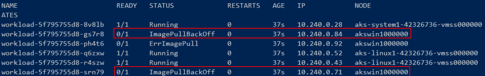 

**NOTE:** Notice some of the pods got created on the Linux nodes, while others got scheduled on the Windows nodes, and thus could not be run.  The Linux image specified in the Deployment is not compatible with the Windows 2019 OS running on the Windows nodes.

4. Describe any of the failed pods to see the actual error.

```PowerShell
kubectl describe pod <failed pod name>
```

  

**NOTE:** Without any guidance, the Kubernetes scheduler does its best to distribute workloads evenly across all the nodes that have available resources.  It doesn't examine the contents of Deployments to confirm that their images are compatible with the nodes it selects.

5. Update the **workload.yaml** file to add the following node selector:

```yaml
  nodeSelector:
    kubernetes.io/os: linux
```

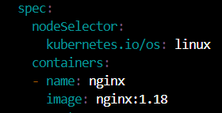 

6. Apply the deployment again and list the pods.

```PowerShell
kubectl apply -f workload.yaml
kubectl get pods -o wide
```

**NOTE:** It will take a few seconds for the bad pods to be deleted, so they may show as **Terminated** for little some time.

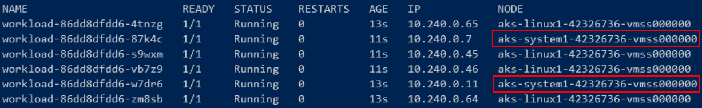 

> Notice that all the pods are running now, but they're spread across both the system and user nodes.  The reason for creating user nodes is to seprate your workloads from system utilities.

7. Update the **workload.yaml** file to add an additional label "**kubernetes.azure.com/mode: user**" to the Node Selector.  The final *nodeSelector* section should look like this:

```yaml
  nodeSelector:
    kubernetes.io/os: linux
    kubernetes.azure.com/mode: user
```

8. Apply the deployment again and list the pods.

```PowerShell
kubectl apply -f workload.yaml
kubectl get pods -o wide
```

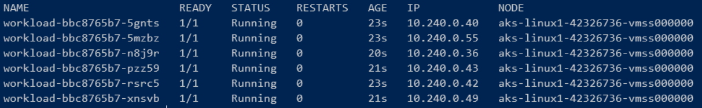 

**PERFECT!**


[Module 2 Table of Contents](#module-2-table-of-contents)

[List of Modules](#modules-list)


# Exercise: Scaling Nodes to Meet Demand

In this exercise you'll watch how the AKS Auto Scaler adjusts the number of nodes based on increased demand and then scales them back down when the load is reduced.  

  

### Task 1 - Verify the names and number of current nodes 

1. Get a list of the Linux user nodes.

```PowerShell
kubectl get nodes -l="kubernetes.azure.com/mode=user","kubernetes.io/os=linux"
```


### Task 2 - Increase the number of replicas to trigger the Auto Scaler to scale up

1. Increase the number of replicas to force the Auto Scaler to create more nodes in the Linux user node pool.

```PowerShell
kubectl scale --replicas=40 deploy/workload
```

2. Get the list of pods.

```PowerShell
kubectl get pods -o wide
```

> Notice that some pods are **Pending** state.

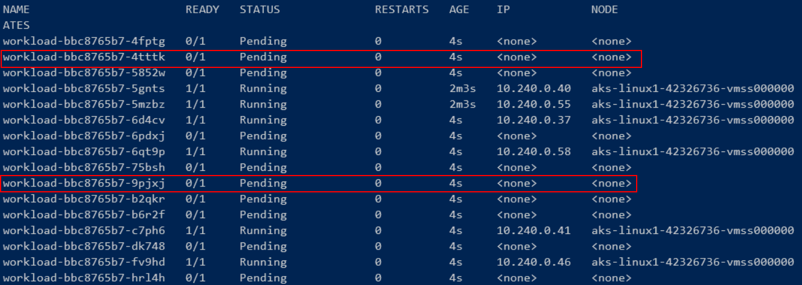 

3. Describe one of the Pending pods
   
```PowerShell
kubectl describe pod <pending pod name>
```

> Notice that the Events section describes the problem and the solution.

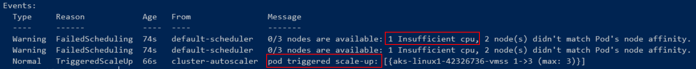 

4. Start a watch on the nodes

```PowerShell
kubectl get nodes -l="kubernetes.azure.com/mode=user","kubernetes.io/os=linux" -w
```

In a few minutes you'll see the number of nodes increase.

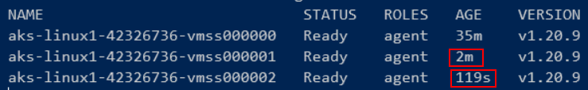 

5. When the new nodes are in a **Ready** state, press *Ctrl-C* to break out of the watch and return to the console. 
   
6. Get a list of pods.

```PowerShell
kubectl get pods -o wide
```

> Notice all the pening Pods are running and they're all in the same node pool, scheduled on the new nodes.

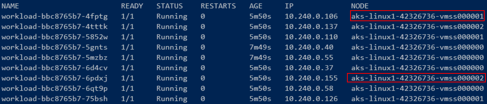 


### Task 3 - Reduce workload to trigger the Auto Scaler to scale down

1. Delete the workload.

```PowerShell
kubectl delete deploy/workload
```

2. Watch the nodes

```PowerShell
kubectl get nodes -l="kubernetes.azure.com/mode=user","kubernetes.io/os=linux" -w
```

**NOTE:** In a few minutes, two of the nodes will go into a **NotReady** state and then disappear.  It will probably *NOT* be both the new nodes that were created.  The "victim" nodes are picked using an internal scale-in policy.

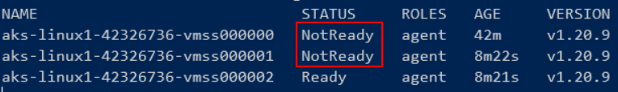

**NOTE:** The cluster autoscaler may be unable to scale down if pods can't be deleted, such as in the following situations:

- A pod is directly created and isn't backed by a controller object, such as a deployment or replica set.

- A pod disruption budget (PDB) is too restrictive and doesn't allow the number of pods to be fall below a certain threshold.

- A pod uses node selectors or anti-affinity that can't be honored by other nodes when the replacement Pod is scheduled.


3. Break out of the watch and keep getting the list of nodes manually.  Repeat the command below until there is only 1 node left.

```PowerShell
kubectl get nodes -l="kubernetes.azure.com/mode=user","kubernetes.io/os=linux"
```

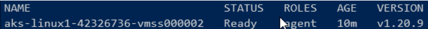


[Module 2 Table of Contents](#module-2-table-of-contents)

[List of Modules](#modules-list)


# Exercise: Examine Container Insights

Now that you've used your cluster for a little while, you should have some metrics and logs in Container Insights to review.


### Task 1 - Review Container Insights

1. Open the Azure Portal in a browser.
   
2. Search for "Kubernetes".  Click on your cluster.
   
3. Scroll down to **Insights** on the option blade.
   
4. Navigate through the various tabs.

**Cluster metrics overview:**
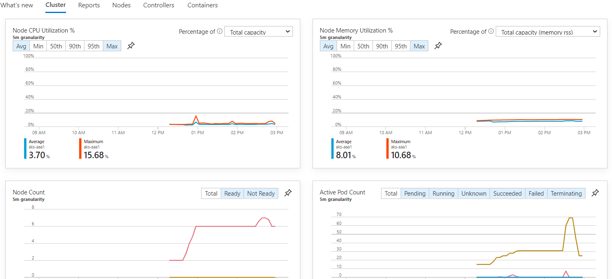


**Nodes list:**
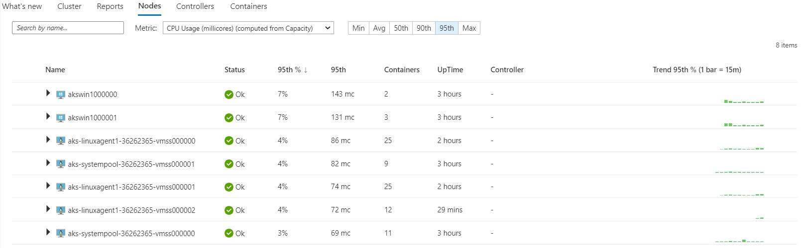


**Containers:**
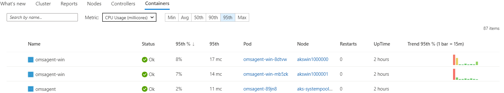

5. Scroll down to **Logs** on the option blade.
   
6. Copy this query into the editor and click **Run**

```kql
KubePodInventory 
| where TimeGenerated > ago(1h)
| join ContainerLog on ContainerID
| project TimeGenerated, Computer, PodName=Name, ContainerName=split(ContainerName, "/",1)[0], LogEntry
```

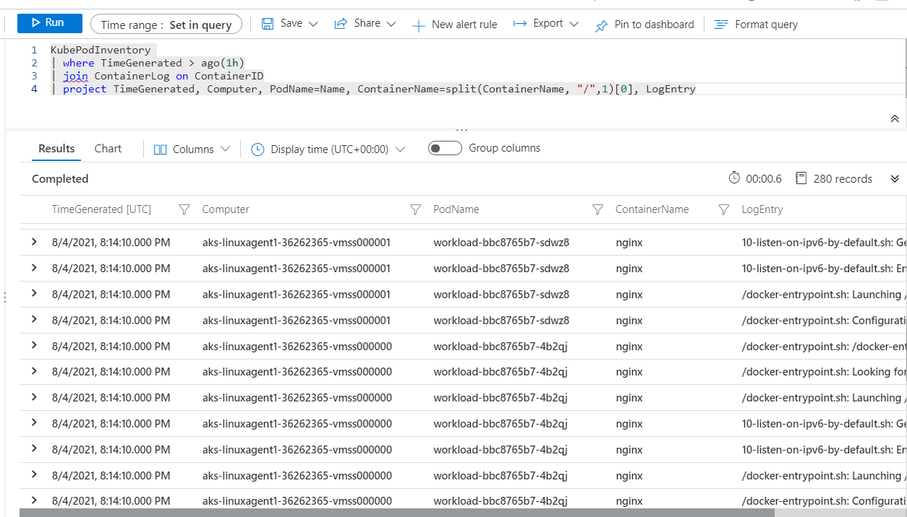

You'll see how the container logs are sent to a Log Analytics Workspace for analysis.

### Sample Kusto Queries for Container Insights

The link below list some common Kusto queries for Container Insights data:

https://docs.microsoft.com/en-us/azure/azure-monitor/containers/container-insights-log-query


[Module 2 Table of Contents](#module-2-table-of-contents)

[List of Modules](#modules-list)


# Exercise: Cleanup Resources


### Task 1 - Delete the cluster and its resources - Azure CLI

When you're done working with the cluster, you can delete it.  You have the complete instructions here on how to recreate it.

It's a good idea to repeat this lab several times, changing some of the settings, in order to get the hang of working with AKS clusters.

1. Deleting the cluster is much easier than creating it.

```PowerShell
az aks delete --resource-group $AKS_RESOURCE_GROUP --name $AKS_NAME
```

2. You can skip deleting these resources if you're planning on recreating just the cluster at a later time.

3. Delete the Log Analytics Workspace.
   
```PowerShell
az monitor log-analytics workspace delete --resource-group $AKS_RESOURCE_GROUP --workspace-name $LOG_ANALYTICS_WORKSPACE_NAME
```

4. Delete the Virtual Network 
   
```PowerShell
az network vnet delete --resource-group $AKS_RESOURCE_GROUP --name $AKS_VNET
```

**HINT: You could go through and delete individual resources above or you could delete the ENTIRE resource group, which will delete everything in it.  Only do this if you place to recreate all the supporting resources**

5. Delete the entire resource group
   
```PowerShell
az group delete --resource-group $AKS_RESOURCE_GROUP
```


### Task 2 - Delete the cluster and its resources - Terraform

1. If you used Terraform to create your cluster, you can delete the cluster and all it supporting resources with the following command:

```PowerShell
terraform destroy -auto-approve
```


[List of Modules](#modules-list)

