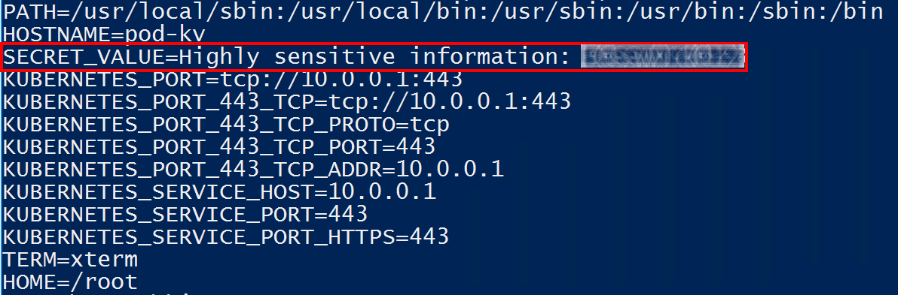

# Lab Module 6: Advanced Kubernetes Topics - Part 1


> Estimated Duration: 60 minutes  

## Module 6 Table of Contents

[Create a Basic AKS Cluster](#create-a-basic-aks-cluster) 

[Exercise: Using Secrets Stored in Azure Key Vault](#exercise-using-secrets-stored-in-azure-key-vault)

[Exercise: Using Taints, Tolerations, Node Selectors and Affinity](#exercise-using-taints-tolerations-node-selectors-and-affinity)

[Shutdown or Delete the AKS Cluster](#shutdown-or-delete-the-aks-cluster)


# Create a Basic AKS Cluster 

For the exercises in this module, you'll need simple AKS cluster.

### Task 1 - Create an AKS cluster (or start an existing one)

1. Select the region closest to your location.  Use '**eastus**' for United States workshops, '**westeurope**' for European workshops.  Ask your instructor for other options in your region:  @lab.DropDownList(region)[eastus,westus,canadacentral,westeurope,centralindia,australiaeast]

2. Define variables (update as needed)
```PowerShell
$AKS_RESOURCE_GROUP="k8s-tech-brief-rg"
$LOCATION="@lab.Variable(region)"
$VM_SKU="Standard_D2as_v5"
$AKS_NAME="ktb-aks"
$NODE_COUNT="3"
```

3. Create Resource Group

```PowerShell
az group create --location $LOCATION `
                --resource-group $AKS_RESOURCE_GROUP 
```

4. Create Basic cluster.  

```PowerShell
az aks create --node-count $NODE_COUNT `
              --generate-ssh-keys `
              --node-vm-size $VM_SKU `
              --name $AKS_NAME `
              --resource-group $AKS_RESOURCE_GROUP
```

5. Connect to local environment

```PowerShell
az aks get-credentials --name $AKS_NAME `
                       --resource-group $AKS_RESOURCE_GROUP 
```

6. Verify connection

```PowerShell
kubectl get nodes 
```


# Exercise: Using Secrets Stored in Azure Key Vault

In this Azure Key Vault exercise, you'll perform the following actions:

1. Enable Key Vault Addon in AKS - Azure installs all the components need to integrate Key Vault with AKS
2. Create an Azure Key Vault - This will contain all the secrets you'll use
3. Grant *administrator* permissions you your account - This will allow you to create secrets in the Key Vault.
4. Create a secret in Azure Key Vault - This will represent the sensitive data you should keep outside the cluster.
5. Great *reader* permissions to the AKS cluster - This will allow the cluster to read the external secret
6. Create custom resources in your cluster to establish the connection to Key Vault - This will specify the AKS identity, Key Vault and secret that will be injected into your Pod.
7. Mount a CSI secrets volume in your Pod - This will use the information in custom resource retrieve and mount your secret.


### Task 1 - Enable Key Vault Addon in AKS and create a Key Vault

1. Define variables. 

```PowerShell
$INSTANCE_ID="@lab.LabInstance.Id"
$AKS_RESOURCE_GROUP="azure-$($INSTANCE_ID)-rg"
$LOCATION="@lab.Variable(region)"
$AKS_IDENTITY="identity-$($INSTANCE_ID)"
$AKS_NAME="aks-$($INSTANCE_ID)"
$KV_NAME="kv-$($INSTANCE_ID)"
```

2. Enable Key Vault Addon in AKS 

```PowerShell
az aks addon enable `
   --addon azure-keyvault-secrets-provider `
   --name $AKS_NAME `
   --resource-group $AKS_RESOURCE_GROUP
```

3. Verify addon has been enabled

```PowerShell
az aks addon list --name $AKS_NAME --resource-group $AKS_RESOURCE_GROUP -o table
```


4. Create Key Vault.  Notice the **--enable-rbac-authorization** option.  This will allow AKS to use its managed identity to access the Key Vault.

```PowerShell
az keyvault create --name $KV_NAME `
   --resource-group $AKS_RESOURCE_GROUP `
   --enable-rbac-authorization
```


### Task 2 - Assign Permissions for you to create Secrets from Key Vault


1. List the secrets in the Key vault.

```PowerShell
az keyvault secret list --vault-name $KV_NAME
```


Even though you created the Key Vault, you don't automatically have access to the Data Plane of the vault.  You must give yourself additional permissions first.

You can assign yourself as the **Key Vault Secrets Officer**, which will allow you to maintain secrets.  You may wish to use **Key Vault Administrator** instead, which will allow you create Keys and Certificates as well.

2. Get the *object id* of the Key Vault:

```PowerShell
$KV_ID=(az keyvault list --query "[? name=='$($KV_NAME)'].{id:id}" -o tsv)
```

3. Get ***your*** object id:

```PowerShell
$CURRENT_USER_ID=(az ad signed-in-user show --query "{objectId:objectId}" -o tsv)
```

4. Assign yourself the Key Vault Officer/Administrator role:

```PowerShell
az role assignment create `
   --role "Key Vault Administrator" `
   --assignee-object-id $CURRENT_USER_ID `
   --scope $KV_ID
```

5. List the secrets in the Key Vault again.  This time you should get an empty list instead of "not authorized" error.

```PowerShell
az keyvault secret list --vault-name $KV_NAME
```

6. Create a sample secret for testing

```PowerShell
az keyvault secret set `
   --vault-name $KV_NAME `
   --name SampleSecret `
   --value "Highly sensitive information: <place data here>"
```

7. Verify the secret is in the Key Vault

```PowerShell
az keyvault secret list --vault-name $KV_NAME -o table
```

You should now see the secret listed.


### Task 3 - Assign Permissions to AKS to read Secrets from Key Vault

You'll need to assign AKS the **Key Vault Secrets User** role so it's able to read the secrets you created.

1. List all available identities.  Find the managed identity created for accessing the Key Vault from AKS when the addon was enabled.

```PowerShell
az identity list --query "[].{name:name,ClientId:clientId}" -o table
```


2. Get the object id of that managed identity AKS is using

```PowerShell
$KV_IDENTITY=(az identity list --query "[? contains(name,'azurekeyvaultsecretsprovider')].{principalId:principalId}" -o tsv)
$KV_CLIENT_ID=(az identity list --query "[? contains(name,'azurekeyvaultsecretsprovider')].{clientId:clientId}" -o tsv)
```

3. Assign the AKS identity permission to read secrets from the Key Vault.

```PowerShell
az role assignment create `
   --role "Key Vault Secrets User" `
   --assignee-object-id $KV_IDENTITY `
   --scope $KV_ID
```


### Task 4 - Create Kubernetes resources and read secret from Key Vault

1. Gather the needed values

```PowerShell
$TENANT_ID=(az aks show --name $AKS_NAME --resource-group $AKS_RESOURCE_GROUP --query "{tenantId:identity.tenantId}" -o tsv)

write-host @"
Client Id: $($KV_CLIENT_ID)
Key Vault Name: $($KV_NAME)
Tenant Id: $($TENANT_ID)
"@
```

2. Change current folder to **Module6**

```PowerShell
cd  C:\k8s\labs\Module6
```


3. Open the file called called **spc.yaml**.

```PowerShell
code spc.yaml
```

4. Replace the placeholders with the values listed above.

```yaml
apiVersion: secrets-store.csi.x-k8s.io/v1
kind: SecretProviderClass
metadata:
  name: azure-kv-secret
spec:
  provider: azure
  parameters:
    usePodIdentity: "false"
    useVMManagedIdentity: "true"
    userAssignedIdentityID: <client-id>    
    keyvaultName: <key-vault-name>
    cloudName: ""
    objects:  |
      array:
        - |
          objectName: SampleSecret
          objectType: secret 
          objectVersion: "" 
    tenantId: <tenant-id>
```

5. Apply the manifest.

```PowerShell
kubectl apply -f spc.yaml
```

6. Review the contents of **pod.yaml**.

```yaml
kind: Pod
apiVersion: v1
metadata:
  name: pod-kv
spec:
  containers:
    - name: busybox
      image: k8s.gcr.io/e2e-test-images/busybox:1.29-1
      command:
        - "/bin/sleep"
        - "10000"
      volumeMounts:
      - name: secrets-store01
        mountPath: "/mnt/secrets-store"
        readOnly: true
  volumes:
    - name: secrets-store01
      csi:
        driver: secrets-store.csi.k8s.io
        readOnly: true
        volumeAttributes:
          secretProviderClass: "azure-kv-secret"
```

7. Apply the manifest.

```PowerShell
kubectl apply -f pod-kv.yaml
```

8. View secret value in Pod

```PowerShell
kubectl exec -it pod-kv -- cat /mnt/secrets-store/SampleSecret 
```

You should now be able to see the content of the Key Vault secret you created earlier.


### Task 5 - Create a Kubernetes Secret from a secret in Key Vault

Many Kubernetes resources use *Secret* resources (Ingress, Persistent Volumes, etc.).  You can extend the configuration about to create a Kubernetes secret object when you mount the Pod.

1. Edit the **SecretProviderClass** you created earlier.

```PowerShell
code spc.yaml
```

Add the indicated section.

```yaml
apiVersion: secrets-store.csi.x-k8s.io/v1
kind: SecretProviderClass
metadata:
  name: azure-kv-secret
spec:
  provider: azure

  ########## Add this section #########
  secretObjects:
  - data:
    - key: MySecret
      objectName: SampleSecret
    secretName: k8s-secret
    type: Opaque 
  ########## End of section #########    
 
  parameters:
    usePodIdentity: "false"
    useVMManagedIdentity: "true"
  ...
```

2. Update the object.

```PowerShell
kubectl apply -f spc.yaml
```

3. Edit the Pod manifest.  Notice the ***env*** section setting the environment variable.

```PowerShell
code pod-kv.yaml
```

```yaml
kind: Pod
apiVersion: v1
metadata:
  name: pod-kv
spec:
  containers:
    - name: busybox
      image: k8s.gcr.io/e2e-test-images/busybox:1.29-1
      command:
        - "/bin/sleep"
        - "10000"
      volumeMounts:
      - name: secrets-store01
        mountPath: "/mnt/secrets-store"
        readOnly: true   
        
      ########## Add this section #########
      env:
      - name: SECRET_VALUE
        valueFrom:
          secretKeyRef:
            name: k8s-secret
            key: MySecret
      ########## End of section #########             

  volumes:
    - name: secrets-store01
      csi:
        driver: secrets-store.csi.k8s.io
        readOnly: true
        volumeAttributes:
          secretProviderClass: "azure-kv-secret"
```

4. Since Pods are immutable, you'll have to delete it and then reapply the manifest.

```PowerShell
kubectl delete pod pod-kv 
kubectl apply -f pod-kv.yaml
```

5. View the secret in the Pod.

```PowerShell
kubectl exec -it pod-kv -- printenv
```



6. Verify the Secret object has been created and is available for other Pods to use.

```PowerShell
kubectl get secret
```


7. Delete the Pod and the Kubernetes Secret object will also be deleted.  Once an injected Secret is no longer referenced by any Pods, it's automatically deleted.


```PowerShell
kubectl delete pod pod-kv
```

```PowerShell
kubectl get secret
```

Once an injected Secret is no longer referenced by any Pods, it's automatically deleted.

[Module 6 Table of Contents](#module-6-table-of-contents)

[List of Modules](#modules-list)


# Exercise: Using Taints, Tolerations, Node Selectors and Affinity

In this exercise, you will work with 3 simple workloads of 12 Pods each.  You’ll ensure that "heavy" workloads are scheduled on Nodes that can handle the loads and "light" workloads don’t clutter up those nodes and use up valuable resources which could be used by the Pods that need them.

## Scenario 

We assume you have 3 nodes in your cluster.  If you don't, please create and AKS cluster with at least 3 nodes.

Assume the following about your AKS cluster:

1. One of the nodes has specialized hardware (GPUs) which make it ideal for hosting graphics processing workloads and for Machine Learning.
2. The other 2 nodes have basic hardware and are meant for general purpose processing.
3. You have 3 workloads you need to schedule in the cluster:
   - Workload 1 – Makes use of heavy GPU hardware for processing tasks.
   - Workload 2 – General purpose
   - Workload 3 – General purpose

The goal of this exercise is to make sure that:

1. Workload 1 Pods are scheduled ONLY on Node 1, so they can take full advantage of the hardware.
2. Workloads 2 & 3 are NOT scheduled on Node 1, so they don’t use up resources which could be used by additional replicas of Workload 1.

You’ll start with 3 workload *yaml* files.  The containers in them are identical, but for the purpose of this lab, you’ll pretend and ***workload1.yaml*** does extensive processing that takes advantage of a GPU in the Node.


### Task 1 – Add workloads to the cluster.

1. Open a Window Terminal window and apply the following workloads:

```PowerShell
kubectl apply -f .\workload-1.yaml
kubectl apply -f .\workload-2.yaml
kubectl apply -f .\workload-3.yaml
```

2. Verify that the Pods are running

```PowerShell
kubectl get pods
```


### Task 2 – Add color and label to node.

1. Get a list of the Nodes.

```PowerShell
kubectl get nodes
```

2. Pick on of the Nodes to be the "GPU" Node (it doesn't matter which one).  Copy it's name by clicking the Right button on your mouse


3. Set a variable to the Node name you selected (replace the NodeName with your selected node)

```PowerShell
$NodeName="aks-userpool1-20365992-vmss000001"
```

3. Add a **color=lime** and **process=GPU** labels to the Node to distinguish it from the others and allow the Pods to find it..

```PowerShell
kubectl label $NodeName color=lime, process=GPU --overwrite
```


### Task 3 – Update the Node Selector of the Workload.

1. Edit the **workload-1.yaml** file to update the node selector to ensure it's only scheduled on the selected node.

```PowerShell
      nodeSelector:
        kubernetes.io/os: linux
        process: GPU
```

2. Save and apply workload1.yaml again.

```PowerShell
kubectl apply -f .\workload-1.yaml
```

3. Verify that the Pods have been rescheduled on the selected node.

```PowerShell
kubectl get pods -o wide
```


4. Notice also that some of other pods are on the same node.  If you scale ***workload-1***, there might not be enough room for the additional pods to be scheduled on the selected node.  Those pods will remain in a **Pending** state because any label specified in the **NodeSelector** is a required to be present on the node before a Pod can be scheduled there.  Since no other nodes have the required label, there's nowhere for the scheduler to place the additional Pods.


### Task 4 – Add a Taint to the Node to prevent other Pods from being scheduled on it.

1. Add a **NoSchedule** taint to the selected node

```PowerShell
kubectl taint nodes $NodeName allowed=GPUOnly:NoSchedule
```

2. The problem is that there are still pods on this node that were scheduled before the node was tainted.  Remove those pods and let the scheduler place the on different nodes

```PowerShell
kubectl delete pods --field-selector=spec.nodeName=$NodeName
```

3. Get a list of Pods

```PowerShell
kubectl get pods
```

4. As you can see the other Pods were rescheduled.  However, ** workload-1** pods are all in a **Pending** state.  


5. Describe one of the Pods to see the problem (substritute one of your pod names)

```PowerShell
kubectl describe pod workload-1-7d7499b8f4-4jmck
```


### Task 5 – Add a Toleration to the Pods so they can be scheduled on the selected Node.

1. Add a toleration to the ***workload-1.yaml*** file (same indentation and **NodeSelector**)

```PowerShell
      tolerations:
      - key: "allowed"
        operator: "Equal"
        value: "GPUOnly"
        effect: "NoSchedule"
```

2. Save and apply the changes.

```PowerShell
kubectl apply -f .\workload-1.yaml
```

3. Review the pods

```PowerShell
kubectl get pods -o wide
```


4. Now you can see that all the ***Workload-1*** pods are on the selected node AND no other pods are scheduled (or will be scheduled) on the selected node.


[Module 6 Table of Contents](#module-6-table-of-contents)

[List of Modules](#modules-list)


# Shutdown or Delete the AKS Cluster

When you're done for the day, you can shutdown your cluster to avoid incurring charges when you're not using it.  This will delete all your nodes, but keep your configuration in tact.

```PowerShell
az aks stop --name $AKS_NAME `
            --resource-group $AKS_RESOURCE_GROUP
```

Or you can choose to delete the entire resource group instead.  You can create a new one prior to the next lab.

```PowerShell
az group delete --resource-group $AKS_RESOURCE_GROUP
```


[List of Modules](#modules-list)